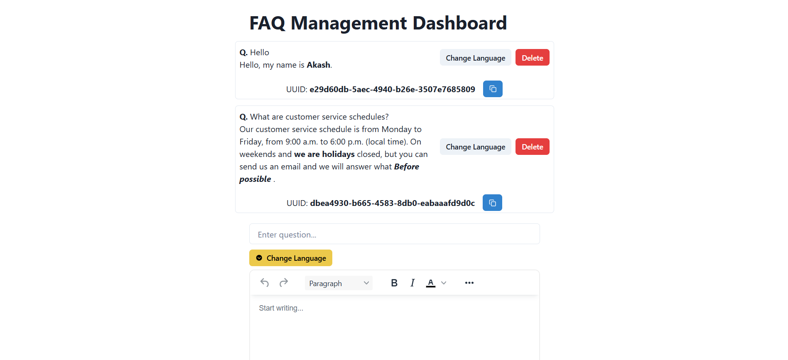

# **BharatFD Backend Challenge**

A backend service for managing FAQs with multilingual support, built using Node.js, Express, Sequelize, and PostgreSQL.

## **Tech-Stack**

- **Backend:** Node.js, Express.js
- **Database:** PostgreSQL, sequelize-orm
- **Caching:** Redis
- **Translation:** Google Translate API
- **Frontend:** React.js, Chakra UI, JavaScript, HTML, CSS
- **WYSIWYG Editor:** TinyMCE Editor
- **Version Control:** Git

---

## **Assumptions**

- Since I am doing this challenge using database as PostgreSQL (which does have a GUI), but due to over-complications in accessing it by the user, I have also created a minimal frontend to test the APIs.
- I have used cloud instances of both the DB and Redis (free-tier), so response times may be a bit slow (Although Render will help in making the responses more efficient 😊)

## Tables

### 1. **FAQ**

The `FAQ` table stores frequently asked questions along with their answers.

| Field Name  | Data Type   | Description                                      |
| ----------- | ----------- | ------------------------------------------------ |
| `id`        | `UUID`      | Primary key                                      |
| `question`  | `TEXT`      | The question being asked (in English)            |
| `answer`    | `TEXT`      | The detailed answer to the question (in English) |
| `createdAt` | `TIMESTAMP` | Timestamp when the entry was created             |
| `updatedAt` | `TIMESTAMP` | Timestamp when the entry was last updated        |

#### `translations` (BSON Object)

This field contains translations of the same content in different languages. Example data for the `transaction` field:

```json
{
  "bn": {
    "answer": "<html><head></head><body><p>প্রতিক্রিয়া একটি জাভাস্ক্রিপ্ট লাইব্রেরি যার<strong>ব্যবহারকারী ইন্টারফেস ব্যবহার করুন</strong>(ইউআই) তৈরি করার জন্য করা হয়। এটি ভিত্তিক উপাদানগুলির উপর ভিত্তি করে, যা ইউআইয়ের পুনরায় ব্যবহারযোগ্য অংশ এবং তাদের ব্যবহার বড় এবং জটিল<em><strong>আবেদন</strong></em>সহজেই বিকাশের জন্য করা হয়।</p></body></html>",
    "question": "প্রতিক্রিয়া কি?"
  },
  "es": {
    "answer": "<html><head></head><body><p>REACT es una biblioteca de Javascript cuya<strong>Utilice la interfaz de usuario</strong>(Ui) se hace para hacer. Se basa en componentes basados, que son partes reutilizables de la interfaz de usuario, y su uso es grande y complejo<em><strong>Solicitud</strong></em>Se hace para desarrollarse fácilmente.</p></body></html>",
    "question": "¿Qué es React?"
  },
  "hi": {
    "answer": "<p>React एक JavaScript लाइब्रेरी है जिसका <strong>उपयोग यूज़र इंटरफ़ेस</strong> (UI) बनाने के लिए किया जाता है। यह कम्पोनेंट्स आधारित है, जो UI के पुनः उपयोग करने योग्य हिस्से होते हैं, और इनका उपयोग बड़ी और जटिल<em><strong> एप्लिकेशन</strong></em> को आसानी से विकसित करने के लिए किया जाता है।</p>",
    "question": "React क्या है?"
  }
}
```

Useful for showing data in different languages in the frontend.

## **Installation**

1. **Clone the repository**

   ```sh
   git clone https://github.com/akash-singh112/bharatfd-challenge.git
   cd bharatfd-challenge
   ```

2. **Install dependencies**

   ```sh
   cd backend-main
   npm install
   cd ..
   cd frontend
   npm install
   ```

3. **Set up environment variables**  
   Create a `.env` file in the root directory (for both backend-main and frontend) and configure the necessary variables (see below).

4. **Start the development server**

   For backend-main:

   ```sh
   node app.js
   ```

   For frontend:

   ```sh
   npm run dev
   ```

   The server will run on the port specified in `.env` for backend-main.

---

## **Environment Variables**

Create a `.env` file with the following variables:

1. For backend-main

```.env
PORT = The port to run the backend on (Eg. 8800)
DB_URL = The URL connection string for your PostgreSQL database (I used Render to create a DB instance, you can too!).
NODE_ENV = production
REDIS_URL = Your redis instance URL connection string (Again, Render provides a free Redis instance for a month, so go for it!)
```

2. For frontend

```.env
VITE_EDITOR_KEY = The API key for your TinyMCE WYSIWYG Text Editor (You can create a free account and get one for 2 weeks!)
VITE_API_URL = http://localhost:8800 (If your backend port is 8800)
```

For local development, you may also use an SQLite database.

---

## **API Usage**

P.S: You can test the APIs by 2 ways

1. By reading below and testing on Postman
2. By using the minimal frontend I have created (Recommended)

### **1. Get all FAQs**

**Endpoint:**

```http
GET /get-faqs
```

**Response:**

```json
{
  "success": true,
  "content": [
    {
      "id": 1,
      "question": "What is Sequelize?",
      "answer": "<p>Sequelize is an <strong>ORM</strong> for Node.js</p>",
      "language": "en"
    },
    {
      "id": 1,
      "question": "What is Python?",
      "answer": "<p>Python is a <strong>simple programming language</strong>.</p>",
      "language": "en"
    }
  ]
}
```

### **2. Create an FAQ**

**Endpoint:**

```http
POST /create-faq/:lang
```

**Request Body:**

```json
{
  "question": "What is Sequelize?",
  "answer": "<p>Sequelize is an <strong>ORM</strong> for Node.js</p>"
}
```

**Response:**

```json
{
  "success": true,
  "content": {
    "id": 1,
    "question": "What is Sequelize?",
    "answer": "<p>Sequelize is an <strong>ORM</strong> for Node.js</p>",
    "language": "en"
  }
}
```

### **3. Delete an FAQ**

**Endpoint:**

```http
DELETE /del/:id
```

**Response:**

```json
{
  "success": true,
  "message": "FAQ deleted successfully"
}
```

---

## **UI**

### Dashboard for API Testing



---

## **Running Tests**

To run the test suite, first cd into backend-main, and then run:

```sh
npm test
```

This will execute both API and database model tests, in order.

---

## **Multilingual support**

In the DB, we have a column `transactions`, of type BSON (which can store key value pairs of languages and their corresponsing question and answer translation, for each FAQ)

---

## **Contribution Guidelines**

We welcome contributions! Please follow these steps:

1. Fork the repository.
2. Create a new branch (`git checkout -b feature-name`).
3. Make your changes and commit (`git commit -m "Add feature X"`).
4. Push your changes (`git push origin feature-name`).
5. Open a pull request.

### **Code Style Guidelines**

- Use Promises and `async`/`await` rather than callbacks.
- Use functional constructs like `map`, `reduce`, and `filter` rather than imperative `for` loops.
- Use [Prettier](https://prettier.io/) to auto-format your code. They have a great [VSCode plugin](https://github.com/prettier/prettier-vscode).
- Use plentiful comments for your helper functions, including commenting atop each helper function to explain what it does. VSCode can auto-generate JSDoc comments for you ([see this guide](https://stackoverflow.com/a/42805312)), which are very helpful.
- Follow the existing project structure.
- Write meaningful commit messages.

---

## **License**

This project is licensed under the MIT License. For more details, read the [LICENSE.md](./LICENSE) doc.

---

## Author

Made with ❤️ by Akash. If you find this application helpful, please give it a ⭐ on [GitHub](https://github.com/akash-singh112).

Also, if you encounter any issues, or have any questions, feel free to contact me at [akashsingh242678@gmail.com](akashsingh242678@gmail.com)
